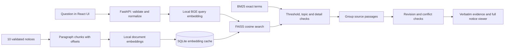

# Find That Notice

**Ask a question. Find the notice. Verify the evidence.**

Source: [anil-yadav-web/AIMedha](https://github.com/anil-yadav-web/AIMedha) · [Automated checks](https://github.com/anil-yadav-web/AIMedha/actions/workflows/ci.yml)

A focused search application for ten campus notices. Students ask in everyday language and receive exact supporting passages with the notice title, publication date, source ID and a full-text viewer. Revised instructions show both sources. No generated answers, chatbot, web crawling or live internet search.

The included notices are **synthetic Indian campus notices**, dated September 2026. They are not official institutional guidance. See [the requirement analysis](docs/REQUIREMENTS.md) and [verification report](docs/VERIFICATION.md).

## Architecture



One Python process serves both `/api/*` and the built frontend. It uses React, TypeScript, Vite, plain responsive CSS, FastAPI, FastEmbed, ONNX Runtime, FAISS, SQLite and BM25. No Docker is required or included, following the user's instruction.

## Retrieval and evidence

1. Validate and normalize a question (1–500 characters).
2. Create a local embedding with `BAAI/bge-small-en-v1.5`; cache up to 256 query embeddings.
3. Search normalized document vectors with FAISS `IndexFlatIP` (cosine similarity).
4. Combine `0.85 * cosine + 0.15 * BM25/(BM25+3)`.
5. Require both semantic and combined scores above `SIMILARITY_THRESHOLD` (default **0.63**); remove scores more than 0.13 below the best match. Use optional topic metadata to constrain explicitly named subjects. For questions about amounts or credentials/connectivity, require corresponding facts in the passage.
6. Group up to three passages per notice and return up to `TOP_K` notices. Related revision counterparts can exceed `TOP_K`, because preserving evidence takes priority over hiding an earlier notice.
7. For relevant deadline/venue/schedule/material facets, compare linked or same-topic notices. Explicit revision metadata or a named source reference, together with revision language, produces `explicit_revision`; inferred language produces `possible_revision`; different same-topic instructions without revision language produces `possible_conflict`.
8. Return source substrings and highlight offsets. The UI highlights matching words; semantic matches may have no literal highlight. Relevance is a ranking score, **not a probability of correctness**.

No completion/generation model is present. Result text always comes from a notice. Generic no-result messages and revision explanations are fixed application text, not generated factual answers. There are no search-engine calls. The local model is downloaded during preparation; queries run locally afterward. Choosing the optional HTTP provider sends embedding inputs to the configured provider, but never performs internet search.

## Dataset and loading

`data/notices.json` is a JSON array with exactly ten records:

```json
{
  "id": "notice_01",
  "title": "AI Tools Workshop for Students",
  "publication_date": "2026-09-01",
  "category": "Workshop",
  "source_filename": "Notice_01.txt",
  "topic": "ai-workshop",
  "content": "One source paragraph.\n\nAnother source paragraph.",
  "revises": []
}
```

IDs must be unique. Title/content cannot be blank. Dates are validated. Revision IDs must point to existing notices with earlier publication dates. `source_filename` is only a display label, never a filesystem path to open. Supplied content is treated as text, never instructions or executable code.

The workshop update (`notice_10`) explicitly revises `notice_01`. Optional `topic` and `revises` fields are strongly recommended for reliable revision detection in custom collections.

On startup the app loads an imported collection from `INDEX_DIR/collection.json`, if present, otherwise `NOTICES_PATH` (default `data/notices.json`). Content/model fingerprints reuse cached embeddings. SQLite commits atomically. A successful API import saves the collection with atomic replacement and swaps the in-memory index only after indexing succeeds. A failed import leaves the current collection active. Use **one worker** to keep in-memory state consistent.

## Local setup

Requirements: Python **3.12**, Node.js **22**, and npm **11**. The commands below invoke a pinned npm version via `npx` if the Node installation bundles an older npm. The model needs an initial download of approximately 70 MB. No embedding API key or GPU is needed.

From the repository root on Windows PowerShell:

```powershell
uv venv --python 3.12 .venv
uv pip install --python .venv\Scripts\python.exe -r backend\requirements.lock
Copy-Item .env.example .env
Set-Location frontend
npx --yes npm@11.6.2 ci
npm run build
Set-Location ..
.venv\Scripts\python.exe -m scripts.prepare
.venv\Scripts\python.exe -m uvicorn backend.app.main:app --host 127.0.0.1 --port 8000 --workers 1
```

If you already have Python 3.12 but not `uv`, create the environment with `py -3.12 -m venv .venv` and install with `.venv\Scripts\python.exe -m pip install -r backend\requirements.lock`.

Open **http://127.0.0.1:8000**. Once built, you can also run `powershell -ExecutionPolicy Bypass -File scripts/start.ps1` from the project folder.

For this prepared workspace, Node/npm are also available locally under `.tools`. If Node isn't on PATH:

```powershell
$env:Path = "$PWD\.tools;" + $env:Path
Set-Location frontend
..\.tools\node.exe ..\.tools\npm-updated\package\bin\npm-cli.js ci
..\.tools\node.exe ..\.tools\npm-updated\package\bin\npm-cli.js run build
Set-Location ..
```

On macOS/Linux:

```bash
python3.12 -m venv .venv
source .venv/bin/activate
pip install -r backend/requirements.lock
cp .env.example .env
cd frontend
npx --yes npm@11.6.2 ci
npm run build
cd ..
python -m scripts.prepare
uvicorn backend.app.main:app --host 127.0.0.1 --port 8000 --workers 1
```

Index initialization is automatic. `scripts.prepare` pre-downloads and checks the model; it is optional locally. Failure to load the configured provider/model produces a clear startup failure and server-side diagnostics. There is no silent switch to keyword-only search or a different model.

## Development frontend and backend

Run the backend from the repository root:

```powershell
.venv\Scripts\python.exe -m uvicorn backend.app.main:app --reload --host 127.0.0.1 --port 8000
```

In another terminal run `npm run dev` from `frontend`. Vite proxies `/api` to the backend. The **development-only** proxy uses localhost; the production frontend exclusively requests relative `/api` URLs.

## Environment variables

Copy `.env.example` to `.env` for local development. Never commit `.env`.

| Variable | Default | Purpose |
|---|---|---|
| `EMBEDDING_PROVIDER` | `fastembed` | `fastembed` for local CPU, or `http` |
| `EMBEDDING_MODEL` | `BAAI/bge-small-en-v1.5` | Supported FastEmbed model, or remote provider model ID |
| `EMBEDDING_API_URL` | empty | Full HTTPS embeddings endpoint for `http` |
| `API_KEY` | empty | Remote provider secret; backend only |
| `SIMILARITY_THRESHOLD` | `0.63` | Minimum cosine and final hybrid score |
| `TOP_K` | `5` | Maximum initially ranked notices (1–10) |
| `QUERY_CACHE_SIZE` | `256` | Bounded query embedding cache |
| `MODEL_CACHE` | `.cache/models` | Local downloaded model files |
| `INDEX_DIR` | `.cache/index` | SQLite embedding cache and imported collection |
| `NOTICES_PATH` | `data/notices.json` | Initial collection, resolved from repository root by default |
| `FRONTEND_DIST` | `frontend/dist` | Built static frontend |
| `ADMIN_TOKEN` | empty | Import secret; writes disabled if absent |
| `CORS_ORIGINS` | `[]` | JSON array of allowed origins; none needed for same-origin production |

Custom relative path overrides resolve against the working directory; start from the repository root. The HTTP embedding provider expects `{"model": "...", "input": ["..."]}` and `{"data": [{"index": 0, "embedding": [...]}]}`. It uses TLS, authorization headers and a 30-second timeout. Calibrate thresholds and rerun evaluation when changing providers/models. Do not put secrets in variables prefixed with `VITE_`.

## Importing a collection

Validate the initial dataset and warm its local embedding cache:

```powershell
.venv\Scripts\python.exe -m scripts.ingest --file data/notices.json
```

To replace a running server's collection, set `ADMIN_TOKEN` in the server environment and your local `.env`, then:

```powershell
.venv\Scripts\python.exe -m scripts.ingest --file data/notices.json --url http://127.0.0.1:8000
```

For Render use your HTTPS URL and the generated Render admin secret. There is no public admin page. All imports replace the complete ten-notice collection. Local cache warming does not activate an alternate file; set `NOTICES_PATH` before starting, or use the protected import API. Existing imported collections take precedence over the seed file on restart.

## Tests and evaluation

```powershell
.venv\Scripts\python.exe -m pytest backend/tests -q
.venv\Scripts\python.exe -m scripts.evaluate
Set-Location frontend
npm test
npm run build
Set-Location ..
.venv\Scripts\python.exe -m scripts.smoke http://127.0.0.1:8000
```

`data/evaluation.json` manually identifies expected notices and, where meaningful, exact chunks for **24 queries**: 17 supported questions and seven unsupported questions. Two queries require the original/revised pair. `scripts.evaluate` reports Hit@1, Hit@3, Recall@5, unsupported rejection, expected-chunk checks and revision checks; it exits nonzero on failed cases. Hit/recall denominators contain only supported queries. Recall@5 measures all expected notices; expected-chunk validation separately checks passages in results and revision panels.

The recorded run achieved **24/24**, **Hit@1 100%**, **Hit@3 100%**, **Recall@5 100%**, **unsupported rejection 7/7**, and both revision checks. These are measurements on a small synthetic calibration set, not a generalization benchmark. Full per-query results are in [evaluation-results.json](docs/evaluation-results.json).

Frontend tests use jsdom and mocked network responses. They verify user interactions, not browser layout. Backend tests and the live smoke script exercise real retrieval. See [VERIFICATION.md](docs/VERIFICATION.md) for the verified scope and remaining checks.

## Native Render deployment — no Docker

The included `render.yaml` creates one **free native Python web service in Singapore**, prebuilds React and downloads the local model during the build. The service has a generated admin token, `/api/health` readiness and one Uvicorn worker. Render supplies the public HTTPS hostname. No paid disk or service is provisioned.

This free demo can sleep after inactivity, so the first request may be slow. Imported collections and runtime embedding caches do not persist across redeploys or instance replacement; the original ten notices are seeded automatically. For durable imports, explicitly upgrade to a paid service, attach a persistent disk and set `INDEX_DIR` to a directory on that disk. The free configuration intentionally does not incur those charges.

1. Create a GitHub repository and push this source tree, including `frontend/package-lock.json`, `backend/requirements.lock`, `render.yaml` and `data/`. Do not upload `.env`, `.venv`, `.tools`, caches or `node_modules`. `python -m scripts.package_source` produces a source-only ZIP if needed.
2. Connect the repository in Render and choose **New → Blueprint**.
3. Review the free `find-that-notice` native Python service and environment variables; apply the blueprint.
4. Wait for build completion and `/api/health` to become ready. Startup automatically builds the index if absent. The model comes from the build cache, not your local computer.
5. Open the service's `https://…onrender.com` URL. Run:

   ```powershell
   .venv\Scripts\python.exe -m scripts.smoke https://YOUR-SERVICE.onrender.com
   ```

6. Verify the full notice dialog and revision panel visually on desktop and mobile. Record the live URL in `docs/VERIFICATION.md`.

For manual Render setup choose **Python**, the **Free** plan, **Singapore**, repository root, the build/start commands in `render.yaml`, and the documented environment variables. Do not attach a paid disk or use a Docker runtime for this demo. Keep a single worker; multiple workers would need coordinated index reloads after imports.

Public deployment requires access to the user's Git provider repository and Render account. **A live URL has not yet been provisioned or verified.** The local app and deployment configuration do not substitute for that acceptance check.

Official references: [Render native runtimes](https://render.com/docs/native-runtimes), [Blueprint specification](https://render.com/docs/blueprint-spec), [Python versions](https://render.com/docs/python-version), and [Node versions](https://render.com/docs/node-version).

## API

Interactive docs: `/docs`. Schema: `/openapi.json`. See [API.md](docs/API.md).

| Endpoint | Purpose |
|---|---|
| `GET /api/health` | Readiness and notice count |
| `POST /api/search` | `{"query":"What should I bring to the workshop?"}` |
| `GET /api/notices` | All ten source notices |
| `GET /api/notices/{id}` | Complete notice text and metadata |
| `POST /api/index` | Protected full collection import; Bearer admin token |

Query failures return a friendly 503; invalid inputs return 422; unknown notices return 404. Search request bodies are limited to 4 KB, imports to 300 KB. Frontend output is escaped React text, not HTML from source documents. CORS is restricted, and security headers include CSP, clickjacking protection and `nosniff`. Hosting-level rate limits can be added for larger public traffic. Secrets and raw stack traces are never returned to students.

## Demo queries

- **What should I bring to the workshop?** → laptop, college ID and notebook, directly from `notice_01`.
- **What do I need to carry for the AI session?** → same evidence through semantic retrieval.
- **When is the registration deadline?** → explicit original/update pair, 15 September and 20 September.
- **Where should hostel documents be submitted?** → Hostel Administration Office passage.
- **Can I take my phone into the exam?** → exact examination restrictions.
- **What is today's weather?** → `No matching information found.`
- **How much is the workshop registration fee?** → no result; the workshop notice gives no fee amount.

## Limitations

- English retrieval and a small synthetic collection. New data needs a fresh evaluation and threshold calibration. Overly conservative rejection can miss valid paraphrases.
- Semantic retrieval cannot guarantee that every accepted passage fully answers every arbitrary question. Exact evidence and full source access remain essential; there is no generated answer to disguise an incomplete match.
- Revision detection is conservative and deterministic. Explicit `revises`/`topic` metadata is preferred; implicit relationships or wording outside the supported facets may be missed. Potential differences may reflect additional context, not an actual contradiction.
- Text JSON ingestion only; no PDF extraction, OCR, upload page or live monitoring.
- Local model download requires network at initial setup/build. Remote embedding mode additionally depends on the configured provider and may incur costs.
- One service instance/worker; unsuitable for distributed concurrent import traffic without coordinated state management.
- Automated tests do not prove visual layout, assistive-technology compatibility, or a successful public deployment. Those require the final browser/hosting checks described above.
